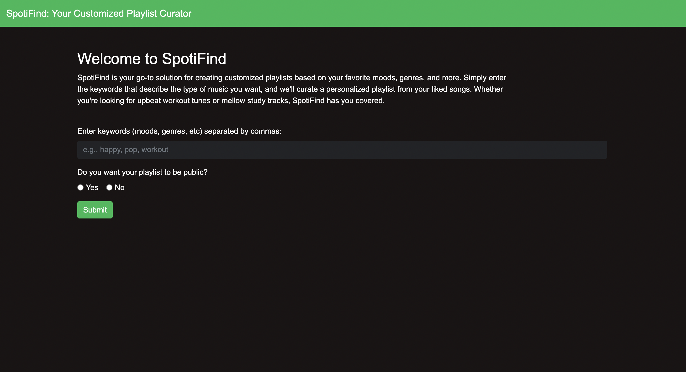
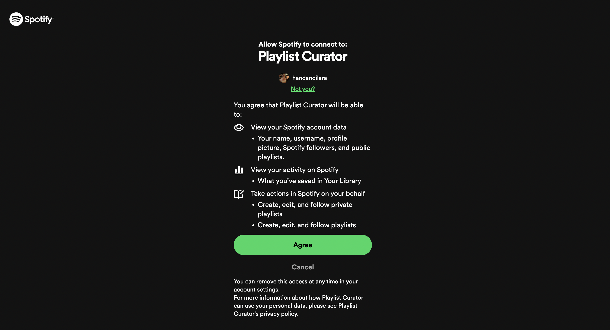
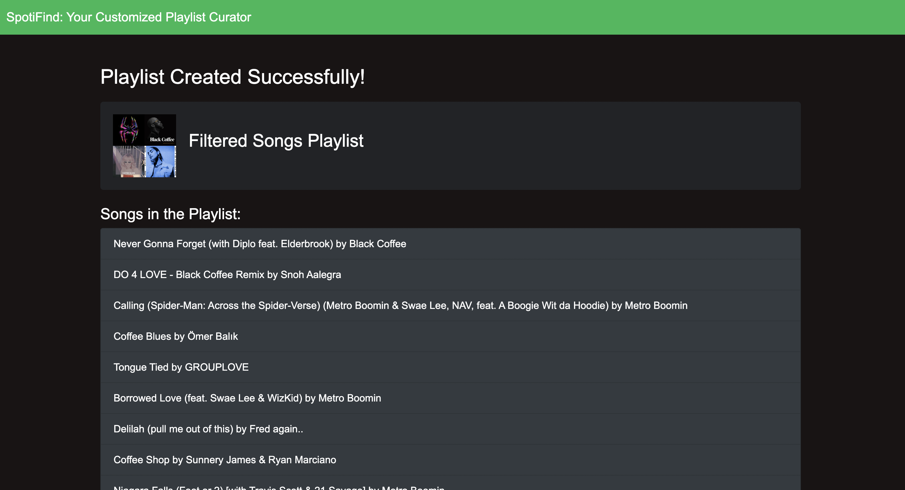

# Spotifind: A Customized Playlist Curator

This web application allows users to log in with their Spotify account and have a customized playlist created for them in the own account based on the keywords that they enter. The app uses the Spotify API to fetch and display the user's liked songs, handling authentication and pagination to ensure all tracks are retrieved. Then, the app displays a preview of the playlist that is created for the user in their Spotify account.

## Features

- User authentication with Spotify
- Fetch and display user's liked songs
- Handles pagination to retrieve all liked songs
- Simple and clean web interface

## Technologies Used

- Python
- Flask
- Spotipy (Spotify Web API library for Python)

## Getting Started

### Prerequisites

- Python 3.x
- Spotify Developer Account
- Flask and Spotipy libraries

### Installation

1. **Clone the repository:**

    ```bash
    git clone https://github.com/dilarabikmaz/spotify_playlist_curator.git
    cd spotify_playlist_curator
    ```

2. **Create and activate a virtual environment:**

    ```bash
    python -m venv venv
    source venv/bin/activate  # On Windows, use `venv\Scripts\activate`
    ```

3. **Install the required packages:**

    ```bash
    pip install -r requirements.txt
    ```

4. **Set up your Spotify Developer account:**

    - Go to the [Spotify Developer Dashboard](https://developer.spotify.com/dashboard/login) and log in.
    - Create a new application and obtain your Client ID and Client Secret.
    - Set the Redirect URI to `http://localhost:5000/callback`.

5. **Configure the application:**

    - Create a `.env` file in the root directory of the project with the following content:

      ```env
      SPOTIPY_CLIENT_ID='your_client_id'
      SPOTIPY_CLIENT_SECRET='your_client_secret'
      SPOTIPY_REDIRECT_URI='http://localhost:5000/callback'
      ```

### Running the Application

1. **Run the Flask application:**

    ```bash
    export FLASK_APP=main.py
    flask run
    ```

    On Windows, use:

    ```bash
    set FLASK_APP=main.py
    flask run
    ```

2. **Open your web browser and go to:**

    ```
    http://localhost:5000/
    ```

3. **Log in with your Spotify account:**

    - You will be redirected to Spotify's login page to authorize the application.
    - After authorization, you will be redirected back to the application where you can see your liked songs.

## Usage

- Visit the home page to log in with your Spotify account.
- After logging in, you will be redirected to the page prompting you to enter keywords and choose whether you want your playlist to be public or not.
- Wait a couple seconds for the app to curate your playlist based on your keywords.
- Check out a preview of your brand new playlist once it is created!
- You can log out by visiting the `/logout` endpoint.

## Demo

### Home Page



### Login Page



### Playlist Preview Page



## Project Structure
```
spotify-liked-songs-web-app/
│
├── main.py # Main Flask application
├── requirements.txt # Python dependencies
├── templates # HTML templates folder
└── README.md # Project README
```

## Acknowledgements

- [Flask](https://flask.palletsprojects.com/)
- [Spotipy](https://spotipy.readthedocs.io/)

## Contact

If you have any questions or suggestions, feel free to contact me at [handandilara.bikmaz@yale.edu](mailto:handandilara.bikmaz@yale.edu).